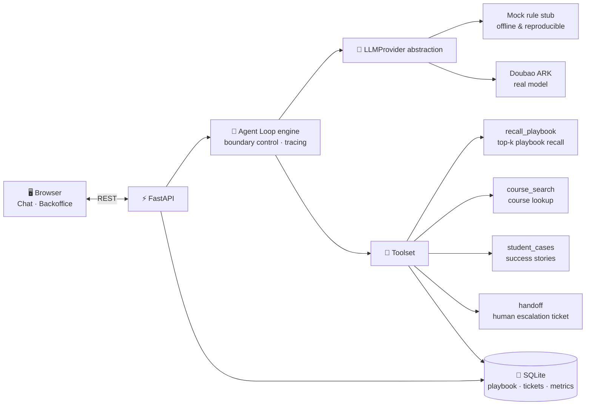
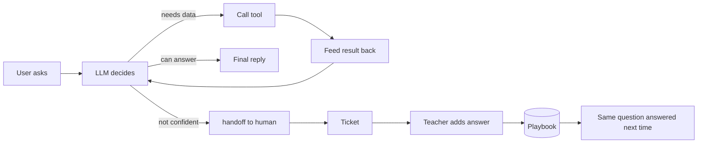

# 🎓 AI Course Consultant — A Teach-While-Chatting Agent Self-Evolution Demo

[](https://www.python.org/)
[](https://fastapi.tiangolo.com/)
[](./LICENSE)
[](#-run-modes)

> 中文: [README.md](./README.md)

**A small-but-complete AI Agent demo**: a teacher teaches sales playbooks to the AI **through conversation**, and the AI answers customers by following those playbooks. When it doesn't know the answer, it **escalates to a human automatically**; after the teacher fills in the answer, **the same question gets answered correctly next time** — the knowledge base grows with usage, the escalation rate keeps dropping, and the system gets smarter the more it's used.

It demonstrates two enterprise-grade techniques end to end:

1. **Agent Loop**: the model autonomously decides in a "reason → pick tool → call → observe → re-decide → finish" loop, with loop boundary control (anti-runaway) and **full trace visualization**;
2. **Teach-to-Evolve closed loop**: unlearned question → escalate to human ticket → teacher adds the answer → stored in the playbook → answered instantly next time — a quantifiable self-evolution flywheel.

**Zero-friction demo**: powered by a swappable **Mock LLM stub** by default — offline, free, reproducible. Switching to a real LLM requires one config line (Doubao / Volcengine ARK implementation built in).

---

## ✨ Features

| Feature | Description |
| --- | --- |
| 🔁 Agent Loop engine | Autonomous tool selection, parallel tool calls, boundary control (max steps / timeout), tool errors fed back to the model for self-correction |
| 👨‍🏫 Teach-as-config | No code needed — teach business playbooks as "question + standard answer + why" triples |
| 📚 Playbook RAG | Top-k semantic retrieval of the most relevant demos, so context never overflows as the library grows; swappable embedding backends with automatic fallback |
| 🧠 Playbook summary | The AI induces general answering strategies from all samples; teachers can rewrite it, and regeneration **preserves the teacher's version** (state merging) |
| 🎫 Self-evolution loop | Not confident → human ticket → answer added via backoffice → same question answered correctly next time |
| ✍️ In-chat refinement | Critique any AI reply on the spot → AI re-answers → one click to **freeze it into a playbook sample** |
| 📊 Quantified evolution | Playbook size, escalation rate, knowledge hit rate in a live dashboard |
| 🔍 Trace visualization | Every step — "what the LLM saw / what it decided / tool inputs & outputs" — visible in the frontend; a powerful Agent debugging tool |
| 🧩 Everything swappable | `LLMProvider` / tools / embedding are all behind abstractions: Mock ↔ real LLM, SQLite ↔ Redis, local vectors ↔ pgvector |

## Architecture



**The Agent Loop:**



## 🚀 Quick Start

### Requirements

- Python **3.10+** (no other prerequisites; Windows / macOS / Linux)

### Install & Run

```bash
# 1. Enter the project directory
cd ai-customer-service

# 2. Create a virtual environment (recommended)
python -m venv .venv
# Windows:        .venv\Scripts\activate
# macOS / Linux:  source .venv/bin/activate

# 3. Install dependencies
pip install -r requirements.txt

# 4. Run
python run.py
```

Open **http://127.0.0.1:8000** in your browser and start the demo.

> Step-by-step Windows guide: [启动指南.md](./启动指南.md) (Chinese).

### Run Modes

| Mode | Config | Notes |
| --- | --- | --- |
| **Mock stub** (default) | none | Rule-based model simulation — offline, free, reproducible; ideal for teaching and development |
| **Real Doubao (ARK)** | copy `.env.example` to `.env` and fill in | Real semantic understanding; requires a Volcengine account |

```bash
# Switch to the real model by editing .env:
LLM_PROVIDER=ark
ARK_API_KEY=<your-key>
ARK_CHAT_MODEL=<your-endpoint-id>
```

`.env` is git-ignored and **never committed**.

### Verify (automated smoke test)

```bash
# Terminal 1: start the server
python run.py

# Terminal 2: run the full demo storyline (teach → Agent Loop → self-evolution)
python _smoke_test.py
# "ALL PASSED" at the end means everything works
```

## 🎬 Five-Minute Demo

Follow [docs/演示用例.md](./docs/演示用例.md) (Chinese). In one sentence:

1. **Teach mode**: turn on the toggle and teach three playbooks (e.g. "How much is the course? → dig for needs first, never quote prices directly");
2. **Agent Loop**: switch back to customer view and ask about pricing / job prospects → watch the **trace** on the right: it recalls playbooks and searches courses / success stories autonomously;
3. **Self-evolution**: ask something never taught (e.g. "How high a threshold can the X1 robot vacuum cross?") → **automatic handoff**;
4. Open the **backoffice**, fill in the answer for the ticket, click "Teach & store";
5. Ask the same question again → **answered instantly** (before: handoff / after: instant answer);
6. Watch the dashboard: playbook size ↑, escalation rate ↓ (**evolution, quantified**).

## 📡 API Overview

| Method | Path | Description |
| --- | --- | --- |
| POST | `/api/chat` | Send a message; returns the reply + full Agent trace |
| POST | `/api/session/reset` | Reset session context |
| POST | `/api/teach` | Teach a playbook sample (question + answer + reason) |
| GET | `/api/playbook` | List playbook samples |
| PUT / DELETE | `/api/playbook/{id}` | Update / delete a sample |
| GET | `/api/playbook/summary` | Playbook summary (auto-induced on first access) |
| PUT | `/api/playbook/summary` | Teacher manually rewrites the summary |
| POST | `/api/playbook/summary/regenerate` | Regenerate with state merging (teacher edits preserved) |
| GET | `/api/tickets` | List tickets |
| POST | `/api/tickets/{id}/teach` | Answer a ticket → stored in playbook & ticket closed |
| POST | `/api/refine` | In-chat refinement: AI re-answers on the spot |
| POST | `/api/refine/commit` | Freeze a refined reply into a playbook sample |
| GET / PUT | `/api/settings/directive` | Global persona / tone / iron rules |
| GET | `/api/settings/system-prompt` | View the effective system prompt |
| GET | `/api/metrics` | Dashboard (playbook size / escalation rate / hit rate) |

## 📁 Project Layout

```
ai-customer-service/
├── run.py                  # entry point: python run.py
├── _smoke_test.py          # smoke test for the demo storyline
├── requirements.txt        # FastAPI / uvicorn / openai / dotenv
├── .env.example            # env template (real secrets go to .env, never committed)
├── app/
│   ├── main.py             # FastAPI routes + static frontend
│   ├── config.py           # global config + loop boundary params
│   ├── db.py               # SQLite init & access
│   ├── models.py           # Pydantic schemas
│   ├── agent/
│   │   ├── loop.py         # ★ Agent Loop engine (reason → tool → observe → re-decide)
│   │   └── tools/          # ★ toolset (register a new tool here and the Loop picks it up)
│   │       ├── recall_playbook.py   # playbook recall (top-k semantic search)
│   │       ├── course_search.py     # course facts lookup
│   │       ├── student_cases.py     # success-story search
│   │       └── handoff.py           # human escalation + tickets
│   ├── llm/
│   │   ├── base.py         # LLMProvider abstraction (implement chat() to swap models)
│   │   ├── mock_provider.py# rule-based stub (offline demo)
│   │   └── ark_provider.py # Doubao / Volcengine ARK (OpenAI-compatible)
│   ├── knowledge/
│   │   ├── embedding.py    # dependency-free local embedding
│   │   └── embedder.py     # unified vectorizer (ark ↔ local with auto-fallback)
│   ├── services/           # chat / playbook / review / settings
│   └── data/               # mock course catalog + success stories
├── static/                 # vanilla HTML/CSS/JS frontend (chat + backoffice)
└── docs/                   # requirements / architecture / demo script / dev notes (Chinese)
```

## 🧠 Design Highlights Worth Studying

- **LLMProvider abstraction**: the Loop depends on a single `chat(messages, tools) -> LLMDecision` contract. Swapping Mock for a real model (OpenAI-compatible / domestic / local) requires **zero changes** to the Loop and tools;
- **Tool registry**: adding a tool = implement `Tool` + register one line; the Loop becomes aware automatically;
- **Boundary control**: max steps + timeout + tool errors fed back into context — the anti-runaway kit every production Agent needs;
- **Trace-as-debugging**: each step records the full model input, the model's decision, and tool I/O — turning Agent behavior from a black box into a white box;
- **Embedding fallback**: when the real embedding API fails, it silently degrades to local feature hashing — **the conversation never breaks**;
- **State merging**: the AI-induced summary coexists with the teacher's rewrites; regeneration always defers to the teacher's version — a classic human-AI collaboration pattern;
- **Context management**: sessions keep only plain conversation turns; the latest summary/rules are injected into the system prompt every round (see `docs/上下文管理设计方案-对标ClaudeCode.md`).

## 🔌 Using Other Real LLMs

Doubao (Volcengine ARK) is built in. Adding OpenAI / DeepSeek / Qwen / local models is equally simple:

```python
# app/llm/my_provider.py
from .base import LLMProvider, LLMDecision

class MyProvider(LLMProvider):
    def chat(self, messages, tools):
        # 1. Call your model (convert tool defs to its function-calling format)
        # 2. Return LLMDecision(type="tool_call"|"final", tool_calls=[...], content=...)
        ...
```

Then point `LLM_PROVIDER` in `app/config.py` at your implementation. See [app/llm/ark_provider.py](./app/llm/ark_provider.py) (~100 lines, including message/tool format conversion) as a reference.

## 📖 Docs

The `docs/` folder contains detailed design documents in Chinese: requirements & decisions, architecture walkthroughs (beginner-friendly and code-level), context-management design (benchmarked against Claude Code), the demo script, and a retrospective on building this project with AI.

## ❓ FAQ

<details>
<summary>Q: Does the default mode need an API key or internet?</summary>

No. The Mock stub runs fully offline; after `pip install`, the whole demo works without a network.
</details>

<details>
<summary>Q: Do I need code changes to use the real model?</summary>

No. Set `LLM_PROVIDER=ark` in `.env` and fill in the key. The Agent Loop and tools are untouched.
</details>

<details>
<summary>Q: How do I reset the data for a fresh demo?</summary>

Stop the server, delete `data.db` in the project root, and restart — the empty database is recreated automatically.
</details>

<details>
<summary>Q: Is this production-ready?</summary>

It's a **teaching demo**: sessions live in process memory, SQLite is single-machine, and there is no auth. For production: move sessions to Redis, vectors to Chroma/pgvector, and add identity & permissions (the architecture and APIs are designed to be extended this way).
</details>

## 🤝 Contributing

Issues and PRs are welcome! Please read [CONTRIBUTING.md](./CONTRIBUTING.md) first.

## 📄 License

[MIT](./LICENSE) © 2025 The author. Free to use, modify, distribute, and use commercially, as long as the copyright notice is retained.

---

⭐ If this project helps you, a Star is much appreciated!
