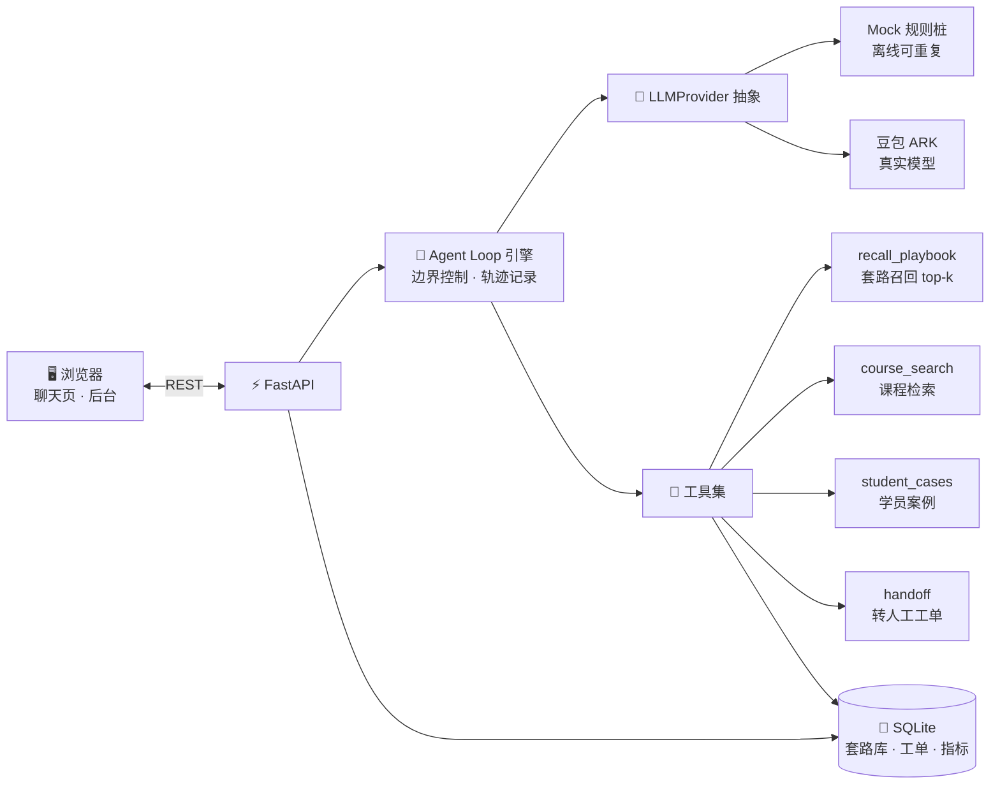
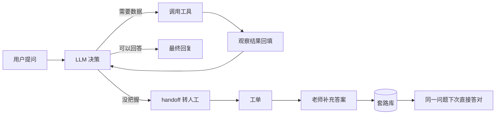

# 🎓 AI 课程咨询顾问 · 边聊边教的 Agent 自进化

[](https://www.python.org/)
[](https://fastapi.tiangolo.com/)
[](./LICENSE)
[](#-两种运行模式)

> English: [README.en.md](./README.en.md)

**一个「麻雀虽小、五脏俱全」的 AI Agent 项目**：老师用**对话**把销售套路教给 AI，AI 按套路应答；答不上来时**自动转人工**，老师补充答案后，**同一个问题下次自动答对**——知识库随使用增长，转人工率持续下降，系统"越用越聪明"。

它完整实现了两个核心技术点：

1. **Agent Loop**：模型在「推理 → 选工具 → 调用 → 观察 → 再决策 → 收尾」的循环中自主决策，带循环边界控制（防死循环）与**全程轨迹可视化**；
2. **教学自进化闭环**：没学过 → 转人工生成工单 → 老师补答案 → 进套路库 → 下次秒答，形成可量化的自进化飞轮。

**零门槛上手**：默认使用可替换的 **Mock 大模型桩**，离线、零成本、结果可重复；换真实大模型只需改一行配置（已内置豆包/火山引擎 ARK 实现）。

---

## ✨ 特性

| 特性 | 说明 |
| --- | --- |
| 🔁 Agent Loop 引擎 | 自主选工具、多工具并行、边界控制（最大步数 / 超时）、工具异常自动回填给模型自纠错 |
| 👨‍🏫 教学即配置 | 不写一行代码，用「问题 + 标准答案 + 这么答的原因」把业务套路教给 AI |
| 📚 套路库（RAG） | top-k 语义检索召回最相关示范，库变大也不会撑爆上下文；向量后端可切换，失败自动降级 |
| 🧠 套路总纲 | AI 从全部示范中归纳通用应答策略；老师可手动改写，重新归纳时**保留老师版本**（状态合并） |
| 🎫 自进化闭环 | 没把握 → 转人工工单 → 后台补答案直接入库 → 同一问题下次自动答对 |
| ✍️ 实测纠偏 | 对任意一条 AI 回复当场提意见 → AI 重答 → 一键**固化为套路** |
| 📊 量化进化 | 套路库条目数、转人工率、知识命中率实时统计 |
| 🔍 轨迹可视化 | 每一步「LLM 看到了什么 / 决定做什么 / 工具入参出参」前端全程可见，调试 Agent 的利器 |
| 🧩 可替换一切 | `LLMProvider` / 工具 / embedding 全部抽象化：Mock ↔ 真实模型、SQLite ↔ Redis、本地向量 ↔ pgvector |

## 架构总览



**Agent Loop 核心循环：**



## 🚀 快速开始

### 环境要求

- Python **3.10+**（无其他依赖要求，Windows / macOS / Linux 均可）

### 安装与启动

```bash
# 1. 进入项目目录
cd ai-customer-service

# 2. 创建虚拟环境（推荐）
python -m venv .venv
# Windows:  .venv\Scripts\activate
# macOS/Linux:  source .venv/bin/activate

# 3. 安装依赖
pip install -r requirements.txt

# 4. 启动
python run.py
```

浏览器打开 **http://127.0.0.1:8000** 即可开始使用。

> Windows 详细图文步骤见 [启动指南.md](./启动指南.md)。

### 两种运行模式

| 模式 | 配置 | 说明 |
| --- | --- | --- |
| **Mock 离线桩**（默认） | 无需任何配置 | 规则模拟模型决策，离线、零成本、结果可重复，适合教学与开发调试 |
| **真实豆包（ARK）** | 复制 `.env.example` 为 `.env` 并填写 | 真实语义理解，Agent 行为更智能；需要火山引擎账号 |

```bash
# 切换真实模型：编辑 .env
LLM_PROVIDER=ark
ARK_API_KEY=<你的密钥>
ARK_CHAT_MODEL=<你的接入点ID>
```

`.env` 已被 `.gitignore` 忽略，**永远不会提交到仓库**。

### 验证安装（自动化冒烟测试）

```bash
# 终端 1：启动服务
python run.py

# 终端 2：跑一遍完整流程（教学 → Agent Loop → 自进化闭环）
python _smoke_test.py
# 结尾打印 ALL PASSED 即一切正常
```

## 🎬 五分钟快速上手

照着 [docs/演示用例.md](./docs/演示用例.md) 操作，一句话版：

1. **教学模式**：打开右上角开关，教 AI 三条套路（如"这个课多少钱？→ 先挖需求，不直接报价"）；
2. **Agent Loop**：切回客户视角问价格/就业 → 看右侧**轨迹**：自动召回套路 + 检索课程/学员案例；
3. **自进化**：问没教过的问题（如"扫地机器人 X1 能翻越多高的门槛？"）→ **自动转人工**；
4. 切到「后台」给工单补答案 → 点「教会它并入库」；
5. 回聊天页再问同一问题 → **直接答对**（同一问题，补充前转人工 / 补充后秒答）；
6. 看顶部指标：套路库条目数 ↑、转人工率 ↓（**进化可量化**）。

## 📡 API 一览

| 方法 | 路径 | 说明 |
| --- | --- | --- |
| POST | `/api/chat` | 发消息，返回回复 + 完整 Agent 轨迹 |
| POST | `/api/session/reset` | 重置会话上下文 |
| POST | `/api/teach` | 教学模式：教一条套路（问题 + 答案 + 原因） |
| GET | `/api/playbook` | 套路库列表 |
| PUT / DELETE | `/api/playbook/{id}` | 修改 / 删除套路 |
| GET | `/api/playbook/summary` | 套路总纲（首次自动归纳） |
| PUT | `/api/playbook/summary` | 老师手动改写总纲 |
| POST | `/api/playbook/summary/regenerate` | 状态合并重新归纳（保留老师改写） |
| GET | `/api/tickets` | 工单列表 |
| POST | `/api/tickets/{id}/teach` | 针对工单补答案 → 进套路库并关闭工单 |
| POST | `/api/refine` | 实测纠偏：AI 当场重答 |
| POST | `/api/refine/commit` | 把纠偏结果固化为套路 |
| GET / PUT | `/api/settings/directive` | 全局业务设定（人设 / 语气 / 铁律） |
| GET | `/api/settings/system-prompt` | 查看完整生效的系统提示词 |
| GET | `/api/metrics` | 统计看板（条目数 / 转人工率 / 命中率） |

## 📁 目录结构

```
ai-customer-service/
├── run.py                  # 启动入口：python run.py
├── _smoke_test.py          # 冒烟测试：验证核心链路
├── requirements.txt        # 依赖（FastAPI / uvicorn / openai / dotenv）
├── .env.example            # 环境变量示例（真实密钥填到 .env，不提交）
├── app/
│   ├── main.py             # FastAPI 路由 + 静态页
│   ├── config.py           # 全局配置 + Loop 边界参数
│   ├── db.py               # SQLite 初始化与读写
│   ├── models.py           # Pydantic 请求/响应模型
│   ├── agent/
│   │   ├── loop.py         # ★ Agent Loop 引擎（推理→工具→观察→再决策）
│   │   └── tools/          # ★ 工具集（新增工具在此登记即可被 Loop 使用）
│   │       ├── recall_playbook.py   # 套路召回（top-k 语义检索）
│   │       ├── course_search.py     # 课程客观信息检索
│   │       ├── student_cases.py     # 学员案例检索
│   │       └── handoff.py           # 转人工 + 工单
│   ├── llm/
│   │   ├── base.py         # LLMProvider 抽象（换模型只需实现 chat()）
│   │   ├── mock_provider.py# Mock 规则桩（离线可重复）
│   │   └── ark_provider.py # 豆包/火山引擎 ARK（OpenAI 兼容）
│   ├── knowledge/
│   │   ├── embedding.py    # 本地轻量 embedding（零依赖）
│   │   └── embedder.py     # 向量化统一入口（ark ↔ local 自动降级）
│   ├── services/           # 对话 / 套路库 / 工单 / 业务设定
│   └── data/               # mock 课程目录 + 学员案例
├── static/                 # 原生 HTML/CSS/JS 前端（聊天页 + 后台）
└── docs/                   # 需求 / 架构 / 演示用例 / 开发复盘
```

## 🧠 技术要点（值得学习的部分）

- **LLMProvider 抽象**：Loop 只依赖 `chat(messages, tools) -> LLMDecision` 一个接口。Mock 换真实模型（OpenAI 兼容 / 国产 / 本地），**Loop 与工具零改动**；
- **工具注册表**：新增工具 = 实现 `Tool` + 登记一行，Loop 自动感知；
- **边界控制**：最大循环步数 + 超时 + 工具异常回填，防止 Agent 失控（企业落地必备）；
- **轨迹即调试**：每一步记录"喂给模型的完整上下文 / 模型决策 / 工具入参出参"，Agent 行为黑盒变白盒；
- **embedding 降级**：真实向量接口失败时自动降级本地特征哈希，**对话绝不中断**；
- **状态合并**：AI 归纳的套路总纲与老师的改写共存，重新归纳时以老师版本为准——人机协作的典型模式；
- **上下文管理**：会话只保留纯对话轮次，系统提示词每轮注入最新总纲/铁律（详见 [docs/上下文管理设计方案-对标ClaudeCode.md](./docs/上下文管理设计方案-对标ClaudeCode.md)）。

## 🔌 接入其他真实大模型

已内置豆包（火山引擎 ARK）。接入 OpenAI / DeepSeek / 通义 / 本地模型同样简单：

```python
# app/llm/my_provider.py
from .base import LLMProvider, LLMDecision

class MyProvider(LLMProvider):
    def chat(self, messages, tools):
        # 1. 调你的模型（工具定义转成对应 function calling 格式）
        # 2. 返回 LLMDecision(type="tool_call"|"final", tool_calls=[...], content=...)
        ...
```

然后 `app/config.py` 的 `LLM_PROVIDER` 换成你的实现名即可。参考 [app/llm/ark_provider.py](./app/llm/ark_provider.py)（约 100 行，含消息/工具格式转换）。

## 📖 文档导航

| 文档 | 内容 |
| --- | --- |
| [docs/需求清单.md](./docs/需求清单.md) | 项目定位、技术选型、需求决策记录 |
| [docs/演示用例.md](./docs/演示用例.md) | 快速上手指南（每步预期行为） |
| [docs/系统架构思路-通俗版.md](./docs/系统架构思路-通俗版.md) | 架构设计思路，小白也能看懂 |
| [docs/项目架构解读-AI-Agent.md](./docs/项目架构解读-AI-Agent.md) | 代码级架构解读 |
| [docs/上下文管理设计方案-对标ClaudeCode.md](./docs/上下文管理设计方案-对标ClaudeCode.md) | 上下文管理设计，对标 Claude Code |
| [docs/任务清单.md](./docs/任务清单.md) | 开发任务记录与当前结构清单 |
| [docs/指挥复盘-我是如何指挥AI做出这个项目的.md](./docs/指挥复盘-我是如何指挥AI做出这个项目的.md) | 用 AI 开发本项目的全过程复盘（提示词实录） |
| [启动指南.md](./启动指南.md) | Windows 图文启动指南 |

## ❓ 常见问题

<details>
<summary>Q：默认模式要不要 API Key / 联网？</summary>

不需要。默认 Mock 桩完全离线运行，`pip install` 一次后断网也能完整运行。
</details>

<details>
<summary>Q：切到真实模型后需要改代码吗？</summary>

不需要。改 `.env` 的 `LLM_PROVIDER=ark` 并填密钥即可，Agent Loop 与工具代码零改动。
</details>

<details>
<summary>Q：想清空数据重新开始怎么办？</summary>

关闭服务，删除项目根目录的 `data.db`，重新启动会自动重建空库。
</details>

<details>
<summary>Q：这个项目能直接上生产吗？</summary>

它是**教学项目**：会话存进程内、SQLite 单机、无鉴权。生产化建议：会话换 Redis、向量换 Chroma/pgvector、加用户体系与权限（架构与接口已按可扩展方式设计）。
</details>

## 🤝 贡献

欢迎提交 Issue / PR！请先阅读 [CONTRIBUTING.md](./CONTRIBUTING.md)。

## 📄 许可证

[MIT](./LICENSE) © 2025 本项目作者。允许自由使用、修改、分发与商用，保留版权声明即可。

---

⭐ 如果这个项目对你有帮助，请点个 Star 支持一下！
