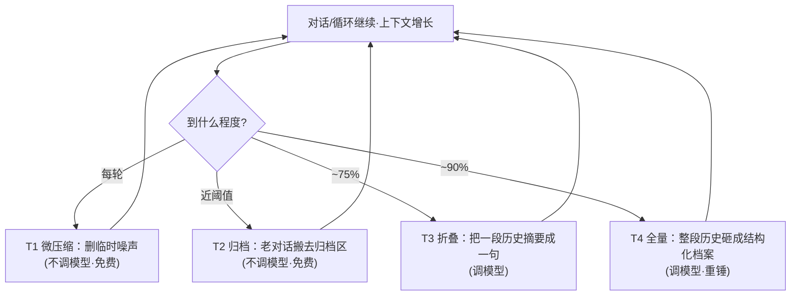
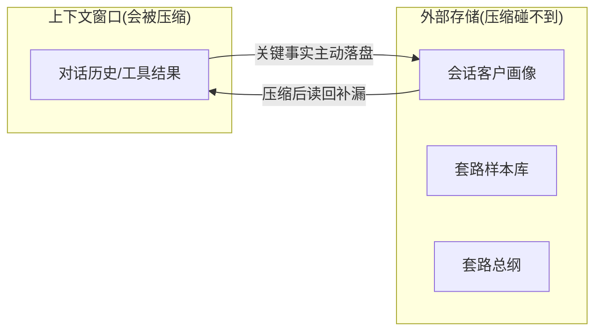

# 本项目上下文管理设计方案(对标 Claude Code)

> 这份文档讨论:如果这个 AI 课程咨询客服要做**严肃的上下文管理**,该怎么做、有哪些取舍。
> 参考对象是 Claude Code 的思路:**T1~T4 分层压缩 + 外部存储兜底 + 子 Agent 脏活隔离**。
> (说明:Claude Code 的压缩只有 T1~T4 四层,不存在 T5;常被误称的"第 5 步"其实是"外部存储落盘兜底"。本文按事实表述。)

---

## 0. 第一性原理:上下文是"预算账户",不是"容器"

先立住格局。很多人把上下文窗口当成一个容器——能装多少装多少、装满为止。这个心智模型是错的。

正确的心智模型是:**上下文是一个有限的预算账户,每一个 token 都是开销,你要为"花在哪"负责。**

往上下文里塞东西有两重成本:

- **直接成本**:token 要花钱、要增加延迟。
- **隐性成本(更致命)**:**无关信息就是噪声。** 塞的垃圾越多,模型注意力越被稀释、关键信息越被淹没。这就是 **context rot**——窗口没满,但信噪比已经塌了,模型表现不升反降。

所以上下文工程的第一性原理不是"尽量多塞有用的",而是:

> **在有限预算内,最大化信噪比——让模型每一轮都恰好看到它需要的,不多,不少。**

下面所有的取舍,都统一在这一句话之下。

---

## 1. 先给本项目做一次"上下文体检"

### 1.1 我们一轮请求的上下文由什么组成

| 组成部分 | 是什么 | 成本性质 |
|----------|--------|----------|
| **系统提示词(三层)** | 基础工作流程 + 业务铁律 + 套路总纲 | **常驻税**:每一轮都在,越长越贵 |
| **会话历史** | 前面几轮聊了什么 | **膨胀项**:随对话轮数增长 |
| **单轮 Loop 内的工具结果** | recall 的 5 条样本、课程信息、案例… | **临时噪声**:当轮用完就该清 |

上下文工程的主战场,就是**控制"膨胀项"和"临时噪声",同时给"常驻税"减负**。

#### 系统提示词这三层长啥样(真实内容示意)

三层是拼接在一起、每轮都塞在对话最前面的。下面是系统里真实的内容(略有精简)。

**第①层:基础工作流程(写死在代码里,最稳定)**——定义角色 + 有哪些工具 + 固定办事套路:

```text
你是一名 AI 课程咨询顾问。你的回答必须遵循老师教过的『套路』,而不是有问必直答……
可用工具:
- recall_playbook:取回老师教过的示范问答与套路(客户问题+标准答案+这么答的原因)。
- course_search:检索课程的客观信息(价格、周期、适合人群、大纲等)。
- student_cases:按城市/客户背景检索学员成功案例……
- handoff:遇到没学过、无法按套路可靠回答的问题时,转人工并生成工单。
工作流程(务必遵守):
1. 回答任何客户咨询前,【必须先调用 recall_playbook】拿到示范样本。
2. 【归纳 + 举一反三】把样本当成整体,归纳老师背后的应答策略……
3. 判断客户这句话属于哪种情况,套用最匹配的示范……
4. 【结合完整对话上下文】先判断已了解到客户哪些信息,信息不足先追问挖掘……
5. 【事实红线】价格/周期等客观事实必须来自 course_search 或样本,绝不可编造。
6. 只有套路库为空、超出能力、或需要没有的事实时才 handoff。
7. 用自然、口语化的中文回复,不要暴露内部流程和工具名。
```
> 特点:**几乎不变**,是每轮的"地板"开销。

**第②层:业务铁律(老师后台可改,优先级最高)**——硬规矩:语气 + 红线:

```text
【语气】回复简洁口语化,一次一般不超过 2-3 句;先回应重点,别长篇大论。
【铁律】
1. 绝不主动报出具体价格数字。客户问价时,不要直接给价格。
2. 面对询价:先确认学习意向,不要急着推进。
3. 客户表达明确意向后,不要自己谈价,而是引导他跟班主任一对一对接。
4. 任何时候都遵循老师教过的套路,信息不足先挖掘需求。
```
> 特点:**短、硬、少变**;冲突时以它为准。

**第③层:套路总纲(AI 从所有样本自动归纳,越教越长)**——把零散样本提炼成通用原则(节选真实归纳结果):

```text
1. 优先级前置原则:还没采集到客户核心信息(届别/学历/编程基础/意向城市/求职现状)前,
   无论客户问什么表层问题,都不直接答,优先引导挖掘需求。
2. 诉求回应原则:采集完信息后,遇就业/适配性问题不做空泛承诺,优先匹配相似画像成功案例佐证。
3. 转化节点管控:报价/引导对接班主任必须同时满足①已采集全部核心信息②已展示适配案例。
4. 意愿唤醒原则:铺垫完不直接推对接,先引导式提问确认意向。
5. 内部资料管控:索要课程大纲等非公开资料,需先满足①②前提再给。
6. 就业承诺红线:严禁"百分百包就业"等虚假承诺,先挖信息再用真实案例佐证。
7. 零散信息适配:客户主动透露部分信息时,先据此匹配案例,输出后必须紧跟意向确认提问。
8. 具象化意向确认:提问要紧扣客户已明确的场景(届别/岗位/城市/薪资)做针对性提问。
```
> 特点:**是膨胀项**——老师每教一条、纠偏一次,它就可能长一点。这正是常驻税里最需要治理(未来分域)的部分。

**三层关系一句话**:`基础流程(不变) + 业务铁律(最高优先) + 套路总纲(会变长)` 拼成完整"工作说明书",每轮塞在最前面;冲突时 **业务铁律 > 套路总纲 > recall 召回的样本话术**。

### 1.2 【关键】我们其实已经天然做了 3 件上下文管理

这一点面试时很加分——说明我们不是硬套概念,而是**这套架构本身就内含了上下文管理的思想**:

1. **会话只存"用户消息 + 最终回复",已经剥离了工具调用噪声。**
   一轮 Loop 里产生的 `recall_playbook`/`course_search` 等中间调用和原始返回,**不会进入跨轮的会话历史**。这本质上就是 Claude Code 的 **T1 微压缩**——工具原始输出用完即弃。

2. **套路总纲 = 对全部样本的归纳压缩。**
   我们没有把几十上百条原始样本每轮都塞进提示词,而是先由模型归纳成一份精炼的"套路总纲"再注入。这是一种**语义级压缩**(把一堆示范压成几条原则)。

3. **recall_playbook 已从"全量召回"升级为"top-k 语义检索"。**
   回答时只捞回与当前问题最相关的 5 条样本,而不是把整个库倒进上下文。这正是 Claude Code 强调的**"按需检索,而非全量塞入"**——让"相关性"来决定什么进预算。

### 1.3 现状瓶颈(也就是未来要治的病)

- **多轮长对话**:会话历史会持续增长,目前没有折叠/归档机制。
- **单轮临时噪声**:recall 的 5 条样本 + 课程/案例结果,在当轮内仍占预算(虽然不跨轮)。
- **常驻税上涨**:套路总纲越教越长,每一轮都在为它多付钱。

---

## 2. 把 T1~T4 分层压缩映射到本项目(核心)

Claude Code 的分层压缩精髓是:**能用便宜的手段绝不用贵的**。删和搬不花钱(不调模型),折叠和砸整段才调模型。下面逐层落到我们项目。



### T1 微压缩(每轮纯删,不调模型)

- **做什么**:工具原始结果用完即弃、或只保留用到的字段。
- **落到我们项目**:
  - `course_search` 返回一个完整课程对象(名称/价格/周期/大纲/亮点/关键词…),但当轮可能只用到"价格+周期",其余字段当轮结束即截断。
  - `recall_playbook` 的 5 条样本原文不进跨轮会话(**已实现**)。
- **代价**:几乎为零,是最该先做满的一层。

### T2 归档(搬家,不调模型)

- **做什么**:把最老、已经用不上的整轮对话,从"活动窗口"**搬到归档区**——不是删,是移走,不占当前预算但可回溯。
- **落到我们项目**:多轮咨询里,很早之前的寒暄、已被后续覆盖的问答,搬进归档表;需要复盘时还能查。
- **代价**:内存/存储搬运,不调模型,便宜。

### T3 折叠(调模型,把一段摘要成一句)

- **做什么**:把一段曲折的历史**读懂后摘要成一句**。这是第一次真正调模型(要产出新文字,删/搬做不到)。
- **落到我们项目**:这是**最契合我们业务的一层**。多轮咨询里,客户零零散散透露了"大专、22 届、之前做销售、想去深圳、预算有限",可以折叠成一句**客户画像**:
  > 客户画像:大专/22届/销售转行/意向深圳/预算敏感/意向中等
  用这一句替换掉前面十几轮啰嗦的一问一答。后续每轮模型只需看这句画像,而不是重读全部历史。
- **代价**:每次折叠要调一次模型,有信息损耗风险。

### T4 全量(调模型,砸成结构化档案)

- **做什么**:超长对话触发的最后重锤,把整段历史砸成一份**结构化摘要**。Claude Code 用 9 段模板并强制"用户原话逐字保留"。
- **落到我们项目**:定制一份**结构化会话档案**模板,比如:
  1. 客户原始诉求(逐字保留)
  2. 客户画像(学历/届别/背景/城市/预算)
  3. 已确认的意向强度
  4. 已经给过客户哪些案例
  5. 已触发的关键动作(是否已引导对接班主任)
  6. 待跟进事项
- **代价**:最贵,只在 T1/T2/T3 都削不动时才动用。

> **贯穿原则**:T1 删 → T2 搬 → T3 折叠 → T4 砸,**越往后越贵,越晚用**。绝不一上来就调模型摘要。

---

## 3. 外部存储:客户画像落盘(命根子保险箱)

分层压缩再聪明,也总有压缩丢细节的风险。Claude Code 的解法是**把关键事实主动落盘到外部存储(如 `CLAUDE.md`)**——它永远在窗口之外,压缩碰不到,压完能读回补漏。正因为有这份"双份保险",压缩才敢压得狠。

**落到我们项目**:

- 把**客户画像 + 关键决策**(意向强度、是否已答应对接班主任、报过什么承诺)**落到数据库的"会话档案"**里。
- 压缩(T3/T4)只动对话流水;客户画像这份笔记不在被压范围内。
- 压缩后主动**读回画像补漏**,防止把"客户说过预算有限"这种关键信息压没了。

**加分点**:我们**已经有外部存储的雏形**——套路样本库、套路总纲、对话指标都是"窗口之外的持久记忆"。只要再补上"会话级客户画像"这一块,外部存储体系就完整了。



---

## 4. 子 Agent:脏活隔离(进阶,重点讲权衡)

Claude Code 的子 Agent 思想:**把会产生大量原始内容的"脏活"派给一个临时分身去干,它在"小黑屋"里读一堆东西,只带回一句结论,原始大块随分身销毁、从不进主窗口。**

**我们项目里潜在的适用场景**:

- 比如"跨多个案例库、按客户画像检索并浓缩成一句最有说服力的佐证"——让子 agent 去翻一堆案例,主 agent 只拿回一句"深圳有 3 个同背景学员,最高 28k",原始案例列表不占主窗口。

**但——要诚实讲清楚为什么现在不做**(这段恰恰体现工程判断力):

> 我们当前**对话短(单轮 Loop ≤ 6 步)、库小(样本/案例都是演示级)**,主窗口根本不会被脏活撑爆。**此时上子 Agent 是过度设计**,徒增复杂度。正确做法是:**架构上认知到这条路、留好扩展口子,但等真出现"某一步会拉回海量原始内容"时再上。**

面试时,"知道什么时候**不该**上某个技术"往往比"什么都堆上"更能体现水平。

---

## 5. 专项:给"套路总纲"这个常驻税减负

系统提示词是**常驻税**——它每一轮都在,所以最该精炼。而我们的套路总纲会随着老师不断教学而变长,是常驻税里最容易失控的部分。

两个治理手段:

1. **分域(按话题拆分总纲)**:把单一的大总纲拆成"价格类/学历门槛类/就业类/优惠类"等几域,**只注入与当前问题相关的那一两域**,而不是每轮都把全部原则塞进去。判断"当前问题属于哪一域"这件事,本身也可以交给模型或用召回来做。
2. **规则 vs 示例的取舍**:
   - **业务铁律用"规则"**(紧凑、覆盖面广):比如"绝不主动报价"。
   - **具体话术用"示例"**(直观、不易误解):这正是 `recall_playbook` 召回的样本充当的角色——按需给几条示例,而不是把所有话术写进常驻提示词。

> 核心仍是那句第一性原理:**每一个放进系统提示词的字,都在为之后的每一轮征税,要花得值。**

---

## 6. 触发策略 & 取舍总表

| 层 | 何时触发 | 调模型? | 代价 | 主要风险 |
|----|----------|---------|------|----------|
| **T1 微压缩** | 每轮 | 否 | 极低 | 几乎无(只删已用完的噪声) |
| **T2 归档** | 历史近阈值 | 否 | 低 | 回溯时要能找回 |
| **T3 折叠** | 历史 ~75% | 是 | 中 | 摘要丢细节 → 模型"失忆" |
| **T4 全量** | 历史 ~90% | 是 | 高 | 压太狠丢关键;压太松没效果 |
| **外部存储落盘** | 出现关键事实/决策时(与压缩无关) | 视情况 | 低 | 忘记读回则补不了漏 |
| **子 Agent** | 某步会拉回海量原始内容 | 是(独立窗口) | 高 | 结论浓缩过头 |

**共同的取舍主线:保真度 vs 预算。** 压得太狠模型失忆、后续走偏;压得太松省不下预算、问题依旧。这不是能一次写死的规则,而是要持续权衡的手艺。

---

## 7. 落地路线图(防过度设计,体现工程判断力)


- **现在(库小 / 对话短)**:现有的 **top-k 检索 + 会话剥离工具噪声**已经够用。**不要提前上压缩和子 agent。**
- **中期(对话变长)**:加 **T3 客户画像折叠** + **客户画像落盘**(外部存储)。这两个对多轮咨询体验提升最直接。
- **长期(规模化)**:上 **总纲分域** + **T4 结构化会话档案** + **子 Agent 脏活隔离**。

这条路线的隐含原则:**每一步升级都由"真实出现的瓶颈"驱动,而不是为了炫技提前堆砌。**

---

## 8. 面试话术:三句话讲清我们的上下文管理哲学

1. **预算而非容器**:上下文是有限预算账户,目标是最大化信噪比,不是塞满窗口——塞多了反而 context rot、模型变笨。
2. **分层压缩、越贵越晚用**:T1 删(免费)→ T2 搬(免费)→ T3 折叠(调模型)→ T4 砸整段(调模型),能用便宜手段绝不用贵的;而且我们的架构**已经天然内含了 T1(会话剥离噪声)、语义压缩(套路总纲)和按需检索(top-k)**。
3. **关键信息双写落盘**:客户画像、关键决策主动写进外部存储,压缩碰不到、随时读回——**正因为有这份保险,压缩才敢压得狠**。

> 一句话收尾:**上下文管理的本质,是在"让模型记住足够多"和"给未来留足够预算"之间,用一套由便宜到昂贵的分层手段持续做权衡——而这套项目从检索、会话到总纲,已经把这套思想落在了地上。**
