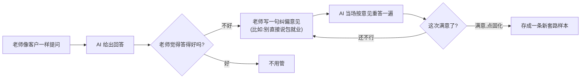
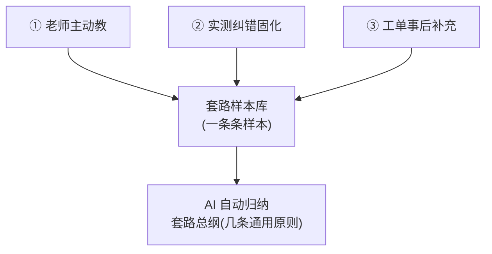
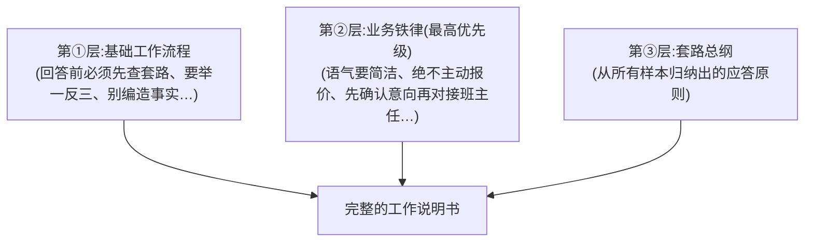
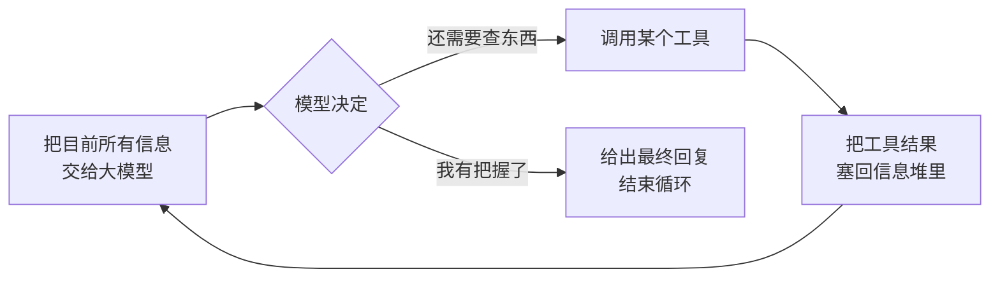
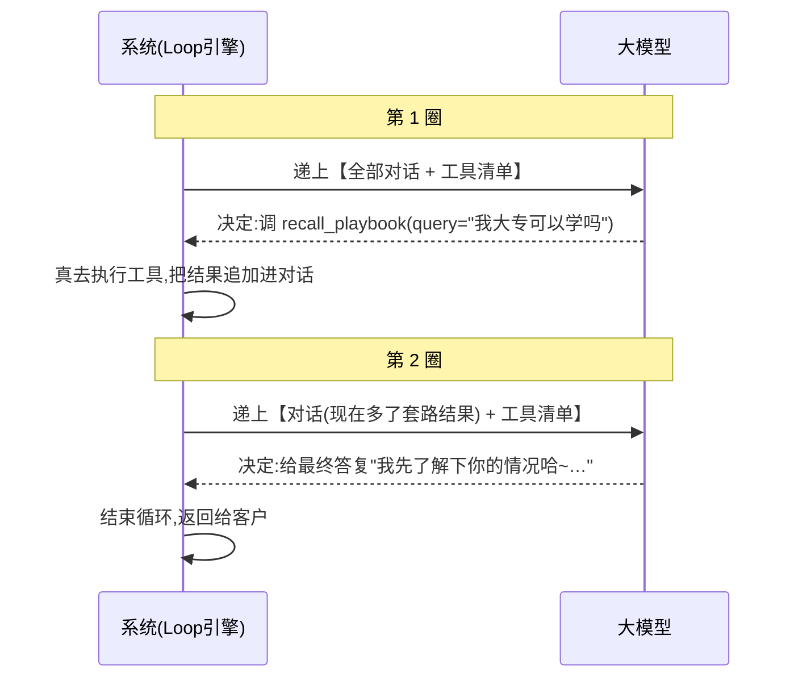
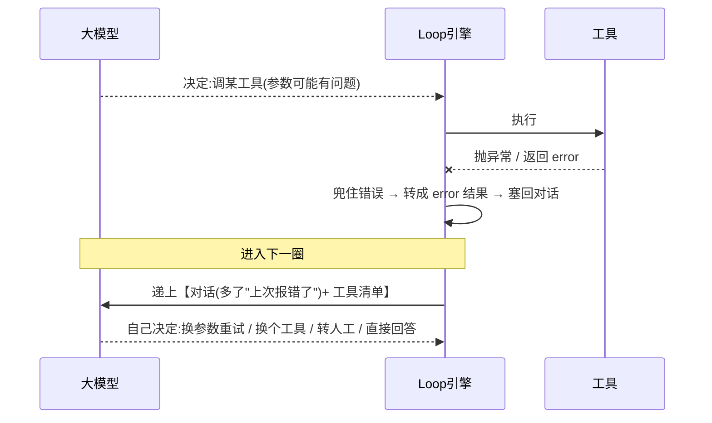
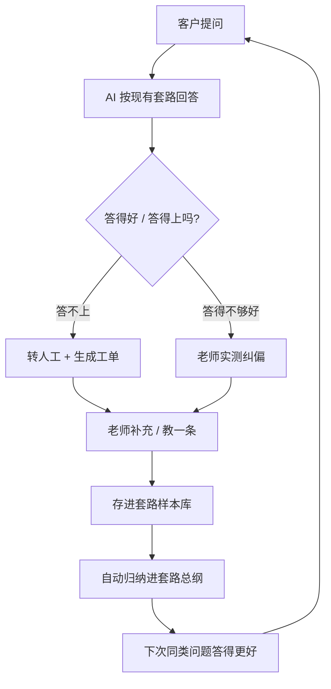

# AI 课程咨询客服 · 系统架构思路(通俗大白话版)

> 这份文档不讲代码,只把"这套系统到底怎么运转"讲清楚。
> 一句话概括:**老师只负责"教",AI 自己把老师教的东西总结成"套路",以后遇到没一模一样教过的问题,也能照着套路灵活应对。**

---

## 开篇:这是个什么系统

这是一个"会按销售套路说话"的 AI 课程咨询客服。

普通客服机器人是"有问必答"——你问价格它就报价格。但真实销售不是这样:客户问"多少钱",好的销售会先了解你的情况、塑造价值,而不是张口就报价。

**这套系统的目标,就是让 AI 学会老师(资深销售/运营)的这套"套路",而不是死板地有问必答。** 更关键的是:老师不用写代码、不用训练模型,只要像带徒弟一样"教"几句,AI 就能学会,而且换个问法也听得懂。

---

## 第一部分:业务的起点 —— 老师教了什么,系统存了什么

一切的源头,是老师往系统里"喂"东西。喂的方式有三种,但**最终都变成同一种东西:一条条"套路样本"**。

### 1.1 教学模式:老师主动教一条

老师在后台"教学模式"里写一条示范,包含**三段**:

| 写什么 | 举个真实例子 |
|--------|--------------|
| **客户问题**(客户可能会怎么问) | 我大专可以学吗？ |
| **标准答案**(遇到这种问题该怎么回) | 你情况介绍我看下呢,哪一届的,有编程基础吗?准备哪里找 |
| **这么答的原因 / 套路**(为什么这么回) | 要先挖掘对方需求 |

为什么一定要有第三段"原因"?因为这才是**套路的灵魂**。AI 不只是背下这句话,而是要理解"哦,遇到问门槛的问题,不要直接回答能不能学,而是要先反问、挖掘对方情况"。理解了原因,它才能举一反三。

### 1.2 纠错(点评式教学):老师边测边改

光靠提前写示范不够,有些问题得实测才发现 AI 答得不好。所以有第二种教法——**点评式纠错**:

**纠错最终存进去的,还是一条套路样本**:客户问题 + 修正后的答案 + 老师的纠偏意见(会标注"实测纠偏")。

举个系统里真实的纠错样本:
- 客户问题:你的这个课程包就业吗？
- 修正后答案:咱们不会随便给你承诺百分百包就业这种不靠谱的话哦……(先反问客户情况)
- 纠偏原因:**(实测纠偏)这个直接回复包就业的就是骗子**

也就是说,老师纠正 AI 一次,就相当于给它多喂了一条更精准的示范。

### 1.3 工单补充:答不上的问题,事后补教

如果客户问了个 AI 完全没把握的问题,它会**转人工**并生成一张"工单"(记下这个没答上的问题)。老师事后可以针对这张工单补一个答案——**补进去的,同样是一条套路样本**。

### 1.4 最终形态:三条路,一个库,一份总纲

不管是"主动教""纠错"还是"工单补充",**最终都汇成同一张"套路样本库"里的一条条样本**。

在这之上,AI 还会自动把所有样本**归纳成一份"套路总纲"**——相当于把一条条零散的示范,提炼成几条通用原则(比如:"任何咨询都要先挖掘客户的届别/学历/城市,信息不够不下结论""绝不承诺包就业")。

> **一句话总结第一部分**:老师的输入 = 一条条样本(问题+答案+原因);系统沉淀下来的 = 一个"样本库" + 一份"总纲"。这就是 AI 的"记忆"和"行动纲领"。

---

## 第二部分:一次用户提问,系统里发生了什么

现在换到客户视角。以客户问 **"我大专可以学吗"** 为例,完整走一遍(下面是系统里真实跑出来的过程)。

### 2.1 输入是什么

进入系统的,是**两样东西**:
- 客户这句话:"我大专可以学吗"
- 这次对话的历史(如果是多轮对话,前面聊过的都带上)

### 2.2 先给 AI"戴上紧箍咒":组装上下文

在让 AI 开口前,系统会先拼一段"给 AI 的工作说明书"(专业叫系统提示词),由**三层**叠起来,优先级从高到低:

**冲突时的规矩:业务铁律 > 套路总纲 > 具体样本话术。** 这样保证老师定的硬规矩(比如"绝不报价")永远不会被带偏。

### 2.3 第一步:AI 决定"先翻手册"

AI 看完客户的问题,**第一反应不是直接回答,而是决定先去查老师教过的套路**(因为工作说明书里写了"回答前必须先查")。

于是它调用了一个叫 `recall_playbook`(翻套路手册)的工具,把客户这句"我大专可以学吗"作为检索词丢进去。

### 2.4 翻手册:靠"意思"而不是"字面"找

这里是关键。手册怎么找出最相关的套路?**不是靠关键词硬匹配,而是靠"语义理解"**(用火山引擎的向量模型把每句话变成一串数字,比"意思有多接近")。

系统只挑出**最相关的 5 条**返回(不是把整个库全倒出来,避免库大了塞爆、也避免噪音)。真实返回结果(带相似度打分):

| 相似度 | 命中的套路(老师教过的问题) |
|--------|------------------------------|
| **0.99** | 我大专可以学吗？ ← 几乎完全命中 |
| 0.45 | 你的这个课程包就业吗？ |
| 0.45 | 课程大纲发我一下 |
| 0.44 | 北京可以找吗？ |
| 0.39 | 你们课程多少钱？ |

最相关的那条(0.99)正是老师教过的"我大专可以学吗",它对应的答案是"先反问客户情况、挖掘需求"。

> **换个问法也懂**:哪怕客户不问"我大专可以学吗",而是问"专科文凭行不行""我学历不高能报名吗",靠语义理解一样能命中这条套路——这就是"换问法也听得懂"的底气,普通关键词匹配做不到。

### 2.5 第二步:拿到套路,按套路作答

AI 拿到这 5 条套路后,把它们当成一个整体理解,判断出:客户这是在问"门槛"类问题,按套路**不该直接回答"能/不能",而应该先挖掘客户情况**。

于是它给出的最终回复是:

> 我先了解下你的情况哈~你是哪一届毕业的呀,有没有编程相关的基础,之后打算在哪个城市找工作,现在是待业还是在做相关的工作呀?

**注意:它没有直接说"大专当然可以学",而是反问客户情况——这就是"遵循套路而非有问必答"。**

### 2.6 输出是什么

系统最终返回给前端:
- **给客户看的回复**(上面那句)
- **一份完整的"调用轨迹"**(trace):AI 每一步想了什么、调了什么工具、工具返回了什么。方便老师调试、看 AI 是怎么"想"的。

### 2.7 自进化怎么体现

假设老师觉得上面这个回答还不够好,他**纠偏一次**(比如"反问要更简短")。这条纠偏被固化成新样本 → 总纲自动更新 → **下次再有人问"我大专可以学吗",AI 的回答就跟着变了**。

**全程不用改一行代码、不用重启、不用重新训练模型。** 老师教得越多、纠得越勤,AI 越聪明——这就是"自进化"。

---

## 第三部分:Agent Loop 到底在"Loop"什么

"Agent Loop"是这套系统的技术核心。很多人以为它很玄,其实一句话就能说清:

> **Loop = "想一步 → 做一步 → 看结果 → 再想下一步",循环往复,直到 AI 觉得有把握给出最终答案为止。**

### 3.1 每一圈(每一步)在干什么

- **想**:把"客户问题 + 对话历史 + 已经查到的东西"一股脑交给大模型。
- **做**:模型自己决定——是再调个工具查点东西,还是直接回答了。
- **看**:如果调了工具,就执行它,把结果**追加**回信息堆里。
- **再想**:带着新结果进入下一圈。

上面第二部分那个例子,其实就 Loop 了 **2 圈**:第 1 圈决定"先查套路"、第 2 圈"拿到套路后作答"。

### 3.2 什么时候停

两种情况会收尾:
1. **模型觉得可以回答了** → 给出最终答复,正常结束。
2. **撞到安全边界** → 比如循环超过 6 步、或超过 30 秒还没搞定,系统强制停下并转人工,防止 AI 陷进死循环。

### 3.3 为什么要 Loop,不能一问一答就完事?

因为真实问题常常**需要好几步**才能答好。比如客户问"北京能找到工作吗":
1. 先查套路 → 发现套路说"要先看有没有客户情况,有的话去查案例"
2. 再查学员案例 → 拿到北京学员的真实案例
3. 最后结合案例作答

一步到位做不到,必须"查一步、看一步、再决定下一步"。

而且——**万一中间某一步失败了(比如某个工具报错),错误会被当成"结果"塞回去,让 AI 自己看到"哦这条路不通",然后换条路或转人工。这就是"自纠错"。** 系统不会因为一个小错误就崩掉。

### 3.4 谁在做决策?—— 全是大模型

最重要的一点:**整个循环里,"下一步干什么"完全是大模型自己决定的,系统没有写任何"如果客户问 X 就干 Y"的死规则。**

传统客服系统是画流程图(if 问价格 then 报价),这套系统是**把决策权完全交给模型**。这也是它和传统机器人最本质的区别,也是所谓"Agent(智能体)"和"Workflow(工作流)"的分水岭。

### 3.5 【重点】大模型到底是怎么"决定"每一步的?

这是整个系统最容易被当成"魔法"的地方。其实拆开看,一点都不玄。每一圈,系统和模型之间就是一次"交接"。

#### 第一步:系统递给模型两样东西

每一圈开始,系统会把两样东西打包交给大模型:

1. **目前为止的全部对话**(专业叫 `messages`)。它不只是客户那句话,而是一叠按顺序排好的消息:
   - 系统提示词(那份三层"工作说明书")
   - 客户的问题
   - **之前每一圈调过的工具、以及工具返回的结果**(如果不是第一圈)
2. **一份"工具清单"**。每个工具都用结构化格式描述清楚三件事:**叫什么名字、是干什么用的(说明书)、需要你填什么参数**。

> 打个比方:系统就像给一个新来的助理递上「客户档案 + 一份《你能用的几个工具及使用说明》」,然后问他:"接下来你打算干嘛?"

#### 第二步:模型吐出一个"决定",只有两种形态

模型读完这两样东西,会返回一个**结构化的决定**(不是随便说一段话),形态只有两种:

| 形态 | 意思 | 长什么样(大意) |
|------|------|------------------|
| **要调工具** | "我还需要查点东西才能答" | 点名一个或多个工具 + 填好参数(比如:调 `recall_playbook`,参数 query="我大专可以学吗") |
| **给最终答复** | "我有把握了,直接回答" | 一段给客户看的话 |

这里有个关键技术点:模型**不是用自然语言说"请帮我调一下那个套路工具"让系统去猜**,而是直接输出一个机器能精确读懂的、结构化的"调用请求"。这个能力叫 **Function Calling(函数调用 / 工具调用)**,是现在主流大模型内置的能力。系统给它规范格式的工具清单,它就回规范格式的调用请求,双方对接得严丝合缝。

另外,模型每一步还可以附带一段**"思考"**(它为什么这么决定),这段思考会被记录进轨迹(trace),方便老师事后看它的心路历程。

#### 第三步:系统照着"决定"执行,然后进入下一圈

系统(也就是 Loop 引擎)是个**忠实的执行者**,它自己不做任何判断,只看模型的决定:

- 如果模型说"调工具" → 系统**真的去执行**那个工具,把返回结果按标准格式**追加回那叠对话里**(并标注清楚"这是刚才那次调用的结果"),然后带着变长了的对话**进入下一圈**,再问模型"现在你打算干嘛?"
- 如果模型说"给最终答复" → 系统**结束循环**,把这句话返回给客户。

#### 那模型"凭什么"这么决定?——三个依据

模型不是瞎猜,它的每个决定都基于三样东西:

1. **工具的说明书写得好不好**。每个工具的"作用说明"直接决定模型知不知道"什么时候该用它"。比如 `recall_playbook` 的说明里明确写了"回答任何咨询前必须先调用",模型就会乖乖先调它。→ **说明书是工具的灵魂,写得含糊模型就会用错。**
2. **系统提示词里的工作流程**。那份"工作说明书"里规定了办事顺序(先查套路、信息不足先挖掘、没把握才转人工),模型会尽量遵守。
3. **它当前已经看到的信息**。这是"看着结果再决定"的精髓——第 2 圈时,对话里已经多了第 1 圈查到的套路,模型看到"哦套路已经拿到了,而且是让我先挖掘需求",于是决定不再调工具、直接反问客户。**同一个问题,信息堆不一样,模型的决定就不一样。**

#### 一句话理解这个机制

> 系统只负责"递材料、执行动作、守边界";**"下一步干什么"这个脑力活,每一圈都重新交给大模型现场判断。** 正因为决策是模型现场做的、而不是提前写死的,它才能应对没被专门教过的问法和多变的对话——这就是 Agent 的"智能"所在。

#### 补充:真实模型 vs 演示桩

这套系统里"大模型"这个角色是**可替换**的:
- 接**真实豆包(火山引擎)**时,上面说的"决定"就是真模型用 Function Calling 能力做出来的。
- 断网演示时,可以换成一个**规则桩**(用简单规则模拟"该调哪个工具"),假装成模型。好处是离线也能演示整个 Loop 流程。

无论用哪个,**Loop 引擎和工具的代码完全不用改**——因为它们只认"决定"这个统一的交接格式,不关心决定是真模型想出来的还是规则模拟的。

### 3.6 工具调用报错了怎么办?—— "错误即上下文"的自纠错

工具是会出错的:参数填得不对、外部接口超时、甚至模型点名了一个根本不存在的工具。这块怎么纠正、怎么重试?**核心结论:系统里没有"写死的重试代码",纠错靠的是"把错误当成一条普通结果喂回给模型,让模型自己看着错误决定下一步"。**

#### 三个动作:兜住 → 转成结果 → 喂回去

Loop 引擎在执行每个工具时,做了三件事:

1. **兜住错误,不让它崩**:用 try/except 把工具抛的任何异常、以及"调了个不存在的工具"这种情况,全部捕获下来,绝不让整个对话因为一个小错误而中断。
2. **把错误转成一条"结果"**:不管成功失败,都变成一条结果。失败时就是一句 `{"error": "……具体错误信息……"}`。
3. **把这条错误结果塞回对话堆**。—— 这一步是灵魂:**错误没有被丢弃,而是变成了模型下一圈能看到的"观察结果"**,和正常的工具返回值一样对待。

#### "重试"其实是模型自己决定的

注意:代码里**没有** "重试 3 次" 这种硬逻辑。真正的"补救"发生在下一圈——模型的上下文里多了一句"你上次调的工具失败了,错误是 XXX",它读到后**自己判断**怎么办:

对模型来说,"工具报错"只是**又一条观察结果**而已,处理它和处理正常结果没有本质区别。它可能换参数重试、改用别的工具、转人工,或基于已有信息直接回答——**决策权始终在模型手里**。

#### 防止一直纠错卡死:边界护栏兜底

万一模型一直纠错一直失败?靠 Loop 的两道边界:**最多 6 步、超 30 秒**,一旦撞到就强制收尾并转人工,绝不会无限重试卡死。

#### 还能被"看见"

每条工具结果都打了"是否出错"的标记,前端看到出错会**红色高亮"⚠️ 触发自纠错"**,并且下一圈的上下文里能看到错误如何被喂回、模型如何重新决策的完整过程,方便调试。

> **一句话:** 纠错不是"代码写死的重试",而是"兜住错误 → 把错误当普通观察结果喂回上下文 → 让模型下一圈自己决定怎么补救";边界护栏保证再怎么纠错也不会失控。这跟人一样——工具没用好,看到报错,再想想换个方式,只不过这里"想"的是大模型。

---

## 第四部分:系统里有哪些工具,分别干嘛

工具就是 AI 的"手"。AI 自己不能凭空知道价格、案例,得靠工具去查。这套系统给 AI 配了 4 个工具:

| 工具 | 大白话作用 | 什么时候用 | 给它什么 / 它返回什么 |
|------|-----------|-----------|----------------------|
| **recall_playbook** (翻套路手册) | **最核心**。取回老师教过的、跟当前问题最相关的套路 | 回答任何咨询前**必用** | 给它客户的问题 → 返回最相关的 5 条套路样本 |
| **course_search** (查课程信息) | 查课程的客观事实:价格、周期、大纲、适合谁 | 涉及课程硬信息、防止 AI 瞎编时 | 给它问题 → 返回匹配的课程信息 |
| **student_cases** (查学员案例) | 查真实的学员成功案例,给客户信心 | 套路要求"用真实案例说话"、且已了解客户情况时 | 给它客户背景 → 返回匹配的学员案例 |
| **handoff** (转人工) | 答不上时转人工、生成工单 | 没学过、没把握、需要 AI 没有的信息时 | 给它问题和原因 → 生成一张工单 |

**一个关键设计:AI"选用哪个工具"这个动作本身,就是"意图识别"。** 系统没有单独做一个"意图分类模块"去猜客户想干嘛,而是让模型看着工具说明自己判断——它决定调 `course_search`,就等于它判断出"这是个问客观信息的问题"。这样更灵活,也更省事。

### 4.1 【常见疑问】到底该"告诉"AI 什么情况调哪个工具,还是让它自己决定?

这是设计 Agent 时最容易纠结的问题。答案是:**两者都不是极端——你要用"自然语言"把每个工具的适用场景讲清楚,但不写死规则,最终由 AI 结合上下文自己拍板。**

#### 三种做法,本项目选中间那条

| 做法 | 怎么做 | 问题 |
|------|--------|------|
| **A. 硬编码死规则** | 在**代码**里写"如果问题含'价格'就调 course_search" | 退回传统流程图机器人,换个问法就失效,失去 Agent 意义 |
| **B. 自然语言引导 ✅ 本项目** | 用大白话在**工具说明**和**系统提示词**里描述"每个工具干嘛、什么时候用",决策交给模型 | —— 这是甜点区 |
| **C. 完全放养** | 只给工具名,啥也不说,全靠模型猜 | 不可靠,模型不知道你的业务规矩(比如"回答前必须先查套路") |

#### 引导藏在两个地方

1. **每个工具的"说明书"(主战场)**:比如 `recall_playbook` 的说明里直接写了"回答任何咨询前必须先调用",`student_cases` 写了"需要用真实案例给客户信心、且已了解客户情况时调用"。模型就是读这些描述来判断该不该用某个工具。**说明书写得越清楚、场景越明确,模型用得越准。**
2. **系统提示词里的"工作流程"**:那些"跨工具的先后顺序"(先查套路 → 涉及事实才查课程 → 需要案例且已了解客户才查案例 → 没把握才转人工)写在全局工作说明书里。

#### 关键:描述"意图/场景",而不是"点名指令"

这是最容易搞混的一点:

- ❌ **点名式(耦合、脆弱)**:"如果客户问就业,就调用 `student_cases` 工具"
- ✅ **意图式(灵活、稳健)**:"当你需要用真实案例给客户信心时,去查学员案例"

意图式**不绑死具体工具名和触发条件**,模型能结合当下上下文灵活判断,哪怕客户问法千变万化,只要"意图"对得上就能自己匹配到工具。

#### 还有一层:业务老师教学时,更要"只说意图,别点名工具"

老师在教学样本里也在间接引导 AI 用工具,原则同样是"描述意图,不点名工具"。真实例子——老师教的一条套路里写的是:

> "如果有同学信息了,可以**给他看北京同学找到工作的案例**"

老师说的是"给他看案例"(意图),**没有写"调用 student_cases 工具"**。AI 读到这个意图,自己就匹配到了对应工具。

为什么不让老师点名工具?① 老师是业务专家,不该也不必懂系统内部有哪些工具;② 一旦点名,教学就和代码实现耦合了——哪天工具改名/重构,所有教学样本都得跟着改,极其脆弱。

#### 一句话总结

> **你要"告诉"它,但用的是"描述场景/意图"的方式,而不是"写死规则"或"逐次点名"。** 你负责把每个工具的适用场景讲清楚(你的责任),AI 负责结合上下文现场决定用哪个(它的智能)。前提是:该场景真的有对应工具存在。

---

## 第五部分:自进化闭环 —— 整个系统怎么"越用越聪明"

把前面的内容串起来,就是一个不断转动的圈:

**核心思想:用"教"代替"重新训练模型"。** 传统做法要改 AI 的行为,得重新收集数据、微调模型,又慢又贵。这套系统里,老师随手教一条、纠一次,AI 立刻就变——轻量、可解释、即时生效。

---

## 第六部分:数据都存在哪(简表)

系统用一个轻量数据库,主要存四类东西:

| 存的东西 | 里面是什么 | 给谁用 |
|----------|-----------|--------|
| **套路样本库** | 一条条样本(问题+答案+套路原因+语义向量) | AI 的"记忆",回答时检索它 |
| **工单** | 答不上的问题记录 | 老师事后补教的入口 |
| **业务设定 + 套路总纲** | 老师定的铁律、AI 归纳的应答原则 | 拼进"工作说明书" |
| **对话指标** | 每轮对话是否命中套路、是否转人工 | 后台看板,看 AI 越来越聪明的量化证据 |

---

## 结尾:三个最关键的设计思想

1. **决策权交给模型**:不写"如果……就……"的死规则,由大模型自己决定每一步干什么。这是 Agent 和传统流程图机器人的根本区别。
2. **一切皆上下文**:老师教的样本是可检索的"记忆";工具查到的结果、甚至报的错,都会被塞回"信息堆"里让 AI 继续参考。AI 的状态,全活在这堆不断增长的上下文里。
3. **教学即训练**:改样本 = 改行为。老师像带徒弟一样教和纠,系统就自我进化,不用碰代码、不用训模型。

> 一句话收尾:**这套系统把"教 AI"这件事,从"程序员改代码 / 算法调模型",变成了"业务老师用大白话带徒弟"。**
