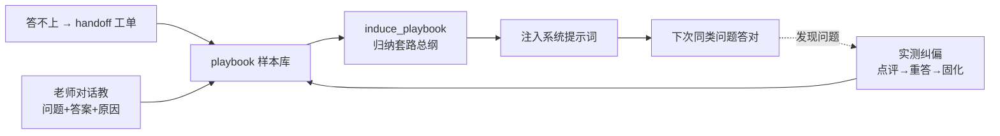
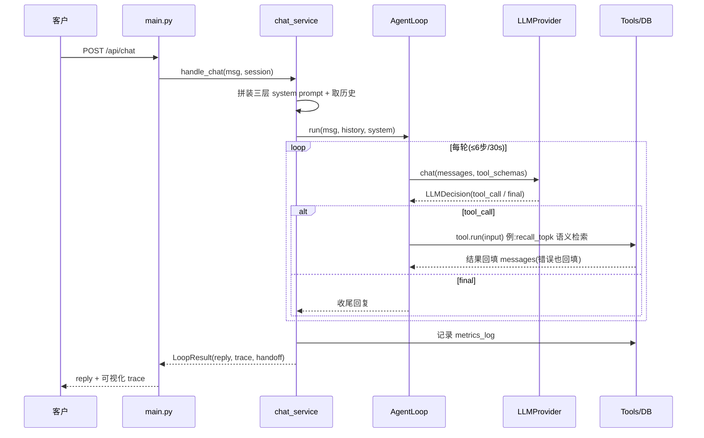

# 项目架构解读 · AI Agent 部分

> 本文聚焦 AI Agent 核心,前端逻辑略过。
> 核心思想一句话:**决策权完全交给大模型**,系统只提供「循环引擎 + 工具 + 上下文」,不写 if-else 的意图分类——这是对齐 Claude Code 的关键。

---

## 一、整体分层

```
app/
├── main.py            FastAPI 路由层(HTTP 入口)
├── config.py          全局配置(边界/模型/top-k)
├── models.py          请求/响应 DTO
├── db.py              SQLite 建表 + 迁移
│
├── agent/             ★ Agent 核心
│   ├── loop.py        Agent Loop 引擎(推理→选工具→调用→观察→再决策)
│   └── tools/         工具层(能力)
│       ├── base.py            Tool 抽象接口
│       ├── recall_playbook.py 套路召回(top-k 语义检索)
│       ├── course_search.py   课程客观信息检索
│       ├── student_cases.py   学员案例检索
│       └── handoff.py         转人工(自纠错闭环起点)
│
├── llm/               ★ 大模型抽象层(可替换)
│   ├── base.py        LLMProvider 接口 + LLMDecision 数据结构
│   ├── ark_provider.py  真实豆包(火山引擎)
│   └── mock_provider.py 离线规则桩
│
├── knowledge/         向量化
│   ├── embedder.py    ARK/本地 embedding + cosine
│   └── embedding.py   老的本地 bigram 向量(course_search 用)
│
├── services/          业务编排层
│   ├── chat_service.py     驱动 Loop + 提示词分层拼装 + 会话管理
│   ├── playbook_service.py 套路库(存向量 + top-k 召回)
│   ├── review_service.py   工单 + 统计
│   └── settings_service.py 业务设定 + 总纲持久化
│
└── data/              mock 数据(课程、案例)
```

---

## 二、Agent Loop 引擎(架构心脏)

`app/agent/loop.py` 是整个 Agent 的心脏,一个 `while` 循环实现
「**推理 → 选工具 → 调用 → 观察结果 → 再决策 → 收尾**」。

每一轮做三件事:

1. 把当前上下文 `messages` + 可用工具 schema 交给 LLM,让它自己决定:调工具还是直接回复。
2. 若返回 `final` → 收尾,把回复给用户。
3. 若返回 `tool_call` → 执行工具(可一步并行多个),把结果作为 observation 回填进 `messages`,进入下一轮。

三个关键设计:

- **边界护栏**:`MAX_LOOP_STEPS=6` + `LOOP_TIMEOUT_SECONDS=30` 双重限制,防死循环,超限自动降级转人工。
- **"错误即上下文"自纠错**:工具异常不中断,而是转成结果回填,让模型自己纠正:

```python
except Exception as exc:  # 工具异常转成观测结果回填,让模型自行纠错
    result = {"error": f"工具 {call.name} 执行出错:{exc}"}
is_error = isinstance(result, dict) and "error" in result
```

- **全链路轨迹**:每步记录 `llm_call`(喂给模型的完整上下文)、`llm_response`(模型原始决策)、`tool_call`/`tool_result`,供前端可视化 Agent 思考链路。

---

## 三、LLM 抽象层(可替换的"大脑")

Loop **只依赖 `LLMProvider.chat()` 接口**,返回统一的 `LLMDecision`:

```python
@dataclass
class LLMDecision:
    type: str                 # "tool_call"(可并行多个) | "final"(产出 content)
    thought: str = ""         # 本步思考,用于轨迹可视化
    tool_calls: list[ToolCall] = field(default_factory=list)
    content: Optional[str] = None
```

两个实现,靠 `.env` 的 `LLM_PROVIDER` 切换:

| Provider | 说明 |
|----------|------|
| `ArkLLMProvider` | 真实豆包,内部消息/工具格式 ↔ OpenAI function calling 格式互转,语义理解由真模型完成 |
| `MockLLMProvider` | 离线规则桩,用正则模拟"该调哪个工具/何时收尾",让 Demo 断网也能跑 |

**换模型不用动 Loop 和工具**,这是"Harness 底座"的解耦价值。

---

## 四、工具层(Agent 的"手")

所有工具继承 `Tool`,暴露 `name/description/parameters` 给模型做 function calling,
`run()` 返回结构化 dict。注册表(`tools/__init__.py`)一处登记即生效。

| 工具 | 作用 | 说明 |
|------|------|------|
| `recall_playbook` | 取回最相关的老师套路 | 核心,回答前必调,top-k 语义检索 |
| `course_search` | 查课程客观信息(价格/周期/大纲) | 事实红线,防编造 |
| `student_cases` | 按背景查学员成功案例 | 套路要"给信心"时调 |
| `handoff` | 转人工生成工单 | 自纠错闭环起点 |

**关键:工具的选择就是意图识别**——没有独立的意图分类模块,模型看工具描述自己判断该用哪个,即"意图识别隐式融入工具选择"。

---

## 五、上下文 / 提示词分层治理

`chat_service.effective_system_prompt()` 每轮动态拼装**三层**,优先级明确:

```
【技术流程 _BASE_PROMPT】             基础工作流(回答前必调 recall_playbook 等)
      ↓
【业务设定 directive】(最高铁律)      语气 / 绝不直接报价 / 先确认意向再对接班主任
      ↓
【套路总纲 summary】                  从样本自动归纳的应答策略
      ↓
recall_playbook 召回的样本话术        最具体的话术参照
```

**优先级:业务铁律 > 套路总纲 > 召回样本话术。**

- **铁律**这类硬规则不适合逐条样本归纳,由老师在后台直接维护(`settings_service`)。
- **总纲**由 AI 从所有样本自动归纳,支持老师改写后"状态合并"保留。
- **样本**是最具体的话术参照,服务时按问句 top-k 召回。

---

## 六、AI 自进化闭环(教学 = 训练)

用"示范学习替代微调"。三条入口都汇入同一张 `playbook` 表:



- **纠偏(点评式教学)**:`refine_reply` 当场重答(不写库)→ 满意后 `commit_refinement` 固化为样本 + 合并总纲。
- **总纲归纳用全量样本**(`recall_all`),因为归纳需要看到所有示范;而**服务时召回用 top-k**——两条路径刻意分开。

---

## 七、语义检索层

`knowledge/embedder.py` 统一 `embed()` / `cosine()`,`playbook_service.recall_topk()`
只召回最相关的 k 条,不再全量塞上下文:

- **ARK 后端**:调用火山引擎 `embeddings/multimodal` 接口(`doubao-embedding-vision-251215`),真实语义向量(2048 维)。
- **本地降级**:ARK 失败(欠费/断网)或 mock 模式时,自动用稳定哈希 bigram 向量,离线可跑、契约不变。
- **存库标记**:样本向量带 `vec_model` 签名,切换后端时自动重算,避免拿旧维度向量瞎比。

三个关键决策:总纲仍看全量、只取 top-k 不设阈值(避免有样本却召回空)、ark↔mock 切换按签名自动重算。

---

## 八、一次咨询请求的完整数据流



---

## 九、数据层(SQLite)

| 表 | 用途 |
|------|------|
| `playbook` | 套路样本库(问题/答案/套路原因 + 向量),Agent 的"记忆" |
| `tickets` | 答不上生成的工单(自纠错闭环起点) |
| `settings` | 业务设定(`business_directive`)+ 套路总纲(`playbook_summary`) |
| `metrics_log` | 每轮对话指标(是否命中/是否转人工),看板统计用 |

---

## 十、总结:这套架构的三个"分水岭"设计

1. **单一循环 + 模型自主决策**:去掉 if-else 意图路由,决策权交模型——Agent 与传统 Workflow 的分界。
2. **一切皆上下文**:训练样本是可检索的"记忆",工具结果 / 错误都回填成 observation,状态活在 `messages` 里。
3. **教学即训练**:业务专家对话教学 → 样本 → 归纳总纲 → 注入提示词,轻量、可解释、改完即时生效,替代微调。

---

## 十一、真实调用轨迹示例(拿一轮对话的 trace 展开)

> 下面是一次真实请求的完整轨迹(`POST /api/chat` 的 `trace` 字段),
> 展示 Agent Loop 如何"召回套路 → 遵循套路应答"。系统提示词较长,此处折叠只标注含义。

**客户输入**:`我大专学历，之前是做销售的，学这个能找到工作吗`

### Step 1 —— 推理 & 选工具

**① `llm_call`**:喂给模型的上下文 = 三层 system prompt(技术流程 + 业务铁律 + 套路总纲)+ 用户这句话;可用工具 = `[recall_playbook, course_search, student_cases, handoff]`。

**② `llm_response`**:模型决定**先召回套路**(回答前必调):

```json
{
  "decision": "tool_call",
  "thought": "调用工具 recall_playbook。",
  "tool_calls": [
    { "name": "recall_playbook",
      "input": { "query": "我大专学历，之前是做销售的，学这个能找到工作吗" } }
  ]
}
```

**③ `tool_result`**:`recall_playbook` 用 ARK embedding 做 **top-k 语义检索**,返回 5 条最相关样本(按 `score` 降序)——注意查询换了问法,依然靠语义命中:

| 排名 | score | 命中的示范问题 |
|------|-------|----------------|
| 1 | **0.646** | 我大专可以学吗 |
| 2 | 0.588 | 你的这个课程包就业吗？ |
| 3 | 0.441 | 我是22届的前端 深圳找 |
| 4 | 0.430 | 北京可以找吗？ |
| 5 | 0.395 | 课程大纲发我下 |

### Step 2 —— 观察结果 & 收尾

**④ `llm_call`**:上下文里已带上一步的 5 条召回样本(observation 回填)。

**⑤ `llm_response` → `final`**:模型归纳这些样本背后的套路(**信息不足先挖掘需求 + 就业承诺红线:绝不乱承诺包就业**),于是没有直接回答"能不能找到工作",而是按套路先反问客户情况:

```
咱们不会随便给你乱承诺百分百能找到工作哦，得先结合你的实际情况给你参考
和你背景差不多的真实学员就业情况~对了先问问你,你是哪一届毕业的,之前有
没有接触过编程相关内容,现在是待业还是在做其他工作,之后打算在哪个城市发展呀?
```

### 这段轨迹说明了什么

- **意图识别隐式化**:没有意图分类器,模型看工具描述自己决定先调 `recall_playbook`。
- **top-k 语义检索生效**:客户问法("大专+销售转行+能否就业")和教过的"我大专可以学吗"用词不同,仍以 0.646 命中排第一;库大也只取 5 条,不撑爆上下文。
- **套路驱动而非有问必答**:模型遵循套路总纲的"信息不足先挖掘""就业承诺红线",把一句简单提问转化为需求挖掘,而不是直接给答案——这正是"回答遵循老师套路"的核心价值。
- **全程可观测**:`llm_call` / `llm_response` / `tool_call` / `tool_result` / `final` 每步都被记录,前端可视化整条决策链路,便于调试。
